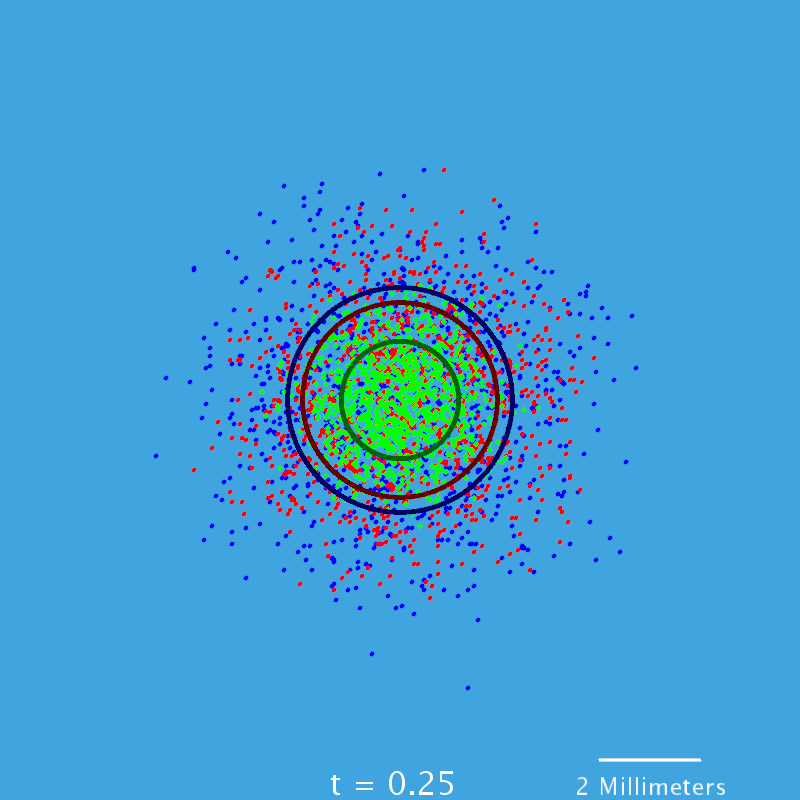
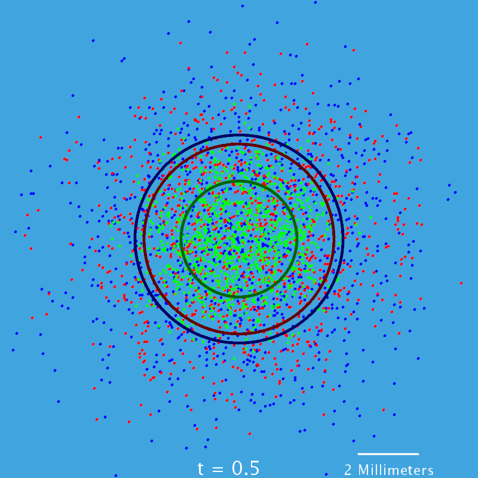
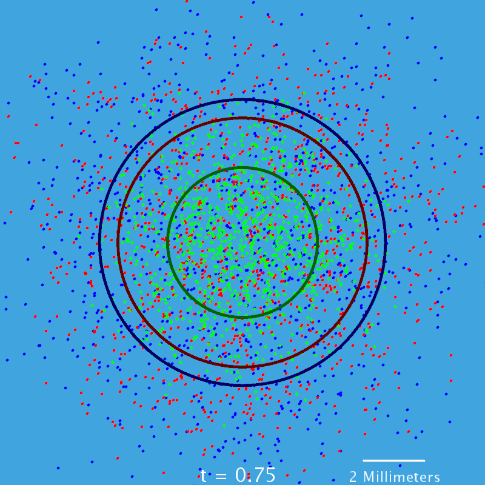

Background
==========

Developing a mathematical model for the diffusion of Brownian particles was a remarkable breakthrough for the fields of Physics and Chemistry. With the publishing of his theory of Brownian motion describing particle diffusion, Albert Einstein developed a mathematical model that allowed for the calculation of the size of atoms, the molecular weight of gas, and the number of atoms in a mole \[3\]. This mathematical model "led to an early, dramatic confirmation of the molecular theory of matter" \[6\].

In this paper, a model of Einstein's relationship, itself a model, is demonstrated, visualized, and compared for three different particles in water for two dimensions. These particles are Hydrogen atoms, Helium atoms, and Nitrogen atoms. Hydrogren and Helium are the first and second most abundant elements in the universe, respectively, and each play an important role in the mechanics of stars and have many industrial applications \[4\] \[5\]. Nitrogen plays an important role in biology and ecosystems, prominently by way of the biogeochemical nitrogen cycle \[1\]. Understanding the diffusion of these particles lends to a further and more robust understanding of these and many more chemical systems.

Development of the Model
========================

This demonstration model will have two primary components:

-   The individual particle agents that represent each atom undergoing diffusion

-   The process by which they move

All particle agents begin at the origin of the model space. After experimentation, it was observed that observation of a 4 millimeter by 4 millimeter model space with a time step of 10 microseconds and a distance step of 10 micrometers is an interesting scale for the diffusion coefficients that contribute to the behavior of the Brownian motion of the chosen particles, though these are decided simply in an *ad hoc* fashion for demonstration, and different scales can be used with this model.

For Brownian motion in two dimensions, there is some probability for a particle stepping one distance step *Δ**x* up, down, left, or right for a given time step *Δ**t*. Einstein's relationship defines each of these probabilities to be different. For implementation of this relationship, there is a 0.25 probability of a particle *asking* to step up, down, left, or right for some time step *Δ**t* in this model. The difference in probability is then subjected to an agent particle by the model's *answer* - whether the particle is allowed to step in that direction.

Determining the probability of *allowing* a step first requires the diffusion coefficients *D* of each particle type. For the sake of this model and demonstration, the particles are assumed to be in water at a temperature of 25 degrees Celsius. These diffusion coefficients are given, in cm<sup>2</sup>/s \[2\]:

|        Hydrogen       |         Helium         |        Nitrogen        |
|:---------------------:|:----------------------:|:----------------------:|
| 4.5 ⋅ 10<sup>−5</sup> | 6.28 ⋅ 10<sup>−5</sup> | 1.88 ⋅ 10<sup>−5</sup> |

The probability *p*(*x*, *t*) of a *single* particle being at a distance *x* from the origin at time *t* is then given by Einstein's diffusion equation \[3\]:

$$p(x,t)= \\frac{1}{\\sqrt{4 \\pi D}} \\frac{e^{\\frac{-x^2}{4Dt}}}{\\sqrt{t}}$$

Let an agent particle be at some location *L* = (*a*, *b*). First, the agent decides with equal probability (0.25) which direction to step. These four possible new locations are (*a* + *Δ**x*, *b*), (*a**i**Δ**x*, *b*), (*a*, *b* + *Δ**x*), and (*a*, *b* − *Δ**x*). The probability of stepping to that point is then described by the diffusion equation above. Therefore, the probability of stepping to one of these new locations at time *t* is given by:

$$\\text{Stepping Left: } \\frac{0.25}{\\sqrt{4 \\pi D}} e^{-((a - \\Delta x)^2 + (b)^2) \\cdot \\frac{1}{4Dt}} \\cdot \\frac{1}{\\sqrt{t}}$$

$$\\text{Stepping Right: } \\frac{0.25}{\\sqrt{4 \\pi D}} e^{-((a + \\Delta x)^2 + (b)^2) \\cdot \\frac{1}{4Dt}} \\cdot \\frac{1}{\\sqrt{t}}$$

$$\\text{Stepping Up: } \\frac{0.25}{\\sqrt{4 \\pi D}} e^{-((a)^2 + (b + \\Delta x)^2) \\cdot \\frac{1}{4Dt}} \\cdot \\frac{1}{\\sqrt{t}}$$

$$\\text{Stepping Down: } \\frac{0.25}{\\sqrt{4 \\pi D}} e^{-((a)^2 + (b - \\Delta x)^2) \\cdot \\frac{1}{4Dt}} \\cdot \\frac{1}{\\sqrt{t}}$$

Several iterations of this process for every agent particle models Einstein's relationship. Realistically, for sake of experiment and implementation, the process of choosing a direction and allowing that step can easily be coded separately, as it is in the demonstration implementation of this model in Java using the Processing Java API, given in the Code Appendix. Still frames from this demonstration are given in Figures 1, 2, and 3 at the end of this document. In these frames, Hydrogen agents are red, Helium agents are blue, and Nitrogen agents are green.

Results
=======

One experiment ran with the demonstration implementation, with a time step of 10 microseconds, after one second, yielded the following results (in Meters):

| Particle |    Minimum Distance    |    Average Distance    |    Maximum Distance    |
|:--------:|:----------------------:|:----------------------:|:----------------------:|
| Hydrogen | 7.62 ⋅ 10<sup>−5</sup> | 1.22 ⋅ 10<sup>−3</sup> | 2.97 ⋅ 10<sup>−3</sup> |
|  Helium  | 4.24 ⋅ 10<sup>−5</sup> | 1.40 ⋅ 10<sup>−3</sup> | 3.50 ⋅ 10<sup>−3</sup> |
| Nitrogen | 2.24 ⋅ 10<sup>−5</sup> | 7.45 ⋅ 10<sup>−4</sup> | 1.86 ⋅ 10<sup>−3</sup> |

Discussion
==========

The results of this experiment show what one would expect given Einstein's theory: the average distance traveled by agent particles with higher diffusion coefficients was higher. Hydrogen and Helium were picked specifically to demonstrate that these diffusion coefficients - and the resulting diffusion - do not simply rely on the size of the particle. Helium is a gas that seldom reacts with other compounds, and Hydrogen's diffusion is disturbed by the water molecules in the model. Hence, Helium has a higher diffusion coefficient and rate. Nitrogen was the slowest of the three, managing to stay nearly twice as close to the point of origin as Hydrogen.

References
==========

> 1.  Britannica, The Editors of Encyclopaedia. "Nitrogen Cycle." Encyclopædia Britannica, Encyclopædia Britannica, Inc., 23 Nov. 2018, www.britannica.com/science/nitrogen-cycle. Accessed March 28, 2019.

> 1.  Cussler, E. L. *Diffusion: Mass Transfer in Fluid Systems (2nd ed.)*. New York, Cambridge University Press, 1997.

> 1.  Einstein, Albert. "Investigations on the Theory of Brownian Movement." \*\*Freien Universität Berlin\*, users.physik.fu-berlin.de/~kleinert/files/eins\_brownian.pdf. Accessed March 28, 2019.

> 1.  Jolly, William Lee. "Hydrogen." *Encyclopædia Britannica*, Encyclopædia Britannica, Inc., 15 Feb. 2019, www.britannica.com/science/hydrogen. Accessed March 28, 2019.

> 1.  Rose, Melinda. "Helium: Up, Up and Away?" *Photonics Media*, 1 Oct. 2008, www.photonics.com/Article.aspx?AID=35225. Accessed March 28, 2019.

> 1.  Siegmund, David O. "Probability Theory." *Encyclopædia Britannica*, Encyclopædia Britannica, Inc., 14 Aug. 2018, www.britannica.com/science/probability-theory/Brownian-motion-process. Accessed March 28, 2019.

Code Apppendix
==============

``` java
import processing.core.*;

/**
 * This program demonstrates the diffusion of Helium, Hydrogen, and Nitrogen in
 * water by utilizing the Processing Java API for animation and returns
 * statistics regarding the experiment
 * 
 * @author Matthew Hefner
 * 
 */
public class Brownian extends PApplet {
    // Helium Agents
    private double[][] agentsHe;
    // Hydrogen Agents
    private double[][] agentsH;
    // Nitrogen Agents
    private double[][] agentsN;
    // Average distances of each type
    private double[] avgs = new double[3];
    // Diffusion Coefficients
    private double DHe = 6.28 * Math.pow(10, -5);
    private double DH = 4.5 * Math.pow(10, -5);
    private double DN = 1.88 * Math.pow(10, -5);
    // Time step
    private double dt = Math.pow(10, -5);
    // Distance step
    private double dX = Math.pow(10, -5);
    // bounds of the screen in model space
    private double[][] bounds = { { -2 * Math.pow(10, -3), 2 * Math.pow(10, -3) },
            { -2 * Math.pow(10, -3), 2 * Math.pow(10, -3) } };
    //Model time
    private float seconds;

    /**
     * Sets up the screen and animation and initializes particle agents.
     */
    public void setup() {
        background(0);
        // Initialize agents to origin
        agentsHe = new double[1000][2];
        agentsH = new double[1000][2];
        agentsN = new double[1000][2];
        // sets framerate of animation
        frameRate(500);
    }

    /**
     * Sets screen size and initializes program frame.
     */
    public void settings() {
        // pixel size of screen
        size(800, 800, P2D);
    }

    /**
     * The loop that drives a Papplet program under the Processing Java API. Each
     * loop of Draw is a time step.
     */
    public void draw() {
        // draw background water color
        background(64, 164, 223);
        // number of passed seconds
        seconds = (float) (dt * frameCount);
        // walk each agent
        walk(agentsHe, 1);
        walk(agentsH, 0);
        walk(agentsN, 2);
        // draw the circles of each average radius
        drawRadius(0);
        drawRadius(1);
        drawRadius(2);
        // time stamp and scale
        stroke(255);
        strokeWeight(3);
        textSize(32);
        fill(255);
        text("t = " + String.valueOf(seconds), width / 2 - 70, height - 5);
        line(width - 100, height - 40, width - 200, height - 40);
        textSize(24);
        text("2 Millimeters", width - 225, height - 5);
        //Saves frames
        if (seconds == 0.75
                || seconds == 0.25
                || seconds == 0.5
                || seconds == 1) {
            saveFrame(frameCount + ".png");
        }
        // stops at 1 second
        if (seconds == 1) {
            stop();
        }
    }

    /**
     * Stops the program, calculates the minimum, maximum, and average distances of
     * each particle type, and prints this information to the console.
     */
    public void stop() {
        println("Time: " + seconds);
        double[] NDists = new double[agentsN.length];
        double[] HDists = new double[agentsH.length];
        double[] HeDists = new double[agentsHe.length];
        //calculate distances from locations
        for (int i = 0; i < agentsN.length; i++) {
            NDists[i] = Math.sqrt(Math.pow(agentsN[i][0], 2) 
                    + Math.pow(agentsN[i][1], 2));
        }
        for (int i = 0; i < agentsH.length; i++) {
            HDists[i] = Math.sqrt(Math.pow(agentsH[i][0], 2) 
                    + Math.pow(agentsH[i][1], 2));
        }
        for (int i = 0; i < agentsHe.length; i++) {
            HeDists[i] = Math.sqrt(Math.pow(agentsHe[i][0], 2) 
                    + Math.pow(agentsHe[i][1], 2));
        }
        println("Hydrogen:\n\tMinimum Distance: " + getMinValue(HDists));
        println("\tAverage Distance: " + getAvgValue(HDists));
        println("\tMaximum Distance: " + getMaxValue(HDists));
        println("Helium:\n\tMinimum Distance: " + getMinValue(HeDists));
        println("\tAverage Distance: " + getAvgValue(HeDists));
        println("\tMaximum Distance: " + getMaxValue(HeDists));
        println("Nitrogen:\n\tMinimum Distance: " + getMinValue(NDists));
        println("\tAverage Distance: " + getAvgValue(NDists));
        println("\tMaximum Distance: " + getMaxValue(NDists));
    }
    
    /**
     * Calculates the distance between (0,0) and a point (x,y)
     * @param x     The x coordinate
     * @param y     The y coordinate
     * @return      The distance to the origin
     */
    public double getDist(double x, double y) {
        return Math.sqrt(Math.pow(x, 2) 
                + Math.pow(y, 2));
    }

    /**
     * Calculates the maximum value of an array of floating point numbers.
     * @param numbers   The array of which the maximum is desired.
     * @return          The maximum of that array.
     */
    public double getMaxValue(double[] numbers) {
        double maxValue = numbers[0];
        for (int i = 1; i < numbers.length; i++) {
            if (numbers[i] > maxValue) {
                maxValue = numbers[i];
            }
        }
        return maxValue;
    }

    /**
     * Calculates the minimum value of an array of floating point numbers.
     * @param numbers   The array of which the minimum is desired.
     * @return          The minimum of that array.
     */
    public double getMinValue(double[] numbers) {
        double minValue = numbers[0];
        for (int i = 1; i < numbers.length; i++) {
            if (numbers[i] < minValue) {
                minValue = numbers[i];
            }
        }
        return minValue;
    }
    
    /**
     * Calculates the average value of an array of floating point numbers.
     * @param numbers   The array of which the average is desired.
     * @return          The average of that array.
     */
    public double getAvgValue(double[] numbers) {
        double avgValue = numbers[0];
        for (int i = 0; i < numbers.length; i++) {
            avgValue += numbers[i];
        }
        return avgValue / (double) numbers.length;
    }

    /**
     * The required main method to drive any Java program. This declares and
     * initializes the processing sketch using the processing API.
     * 
     * @param args Not used.
     */
    public static void main(String[] args) {
        // Making use of the processing library for Java
        String[] processingArgs = { "MySketch" };
        Brownian sketch = new Brownian();
        PApplet.runSketch(processingArgs, sketch);
    }
    
    /**
     * The probability distribution function given by Einstein's relationship.
     * @param x     the distance from the origin
     * @param D     the diffusion coefficient
     * @return      the probability of being at that location
     */
    public double einsteinPDF(double x, double D) {
        return Math.exp(-Math.pow(x, 2) / ((double) (4 * D * seconds)) 
                / (Math.sqrt(4 * Math.PI * D) * Math.sqrt((double) seconds)));
    }

    /**
     * This method takes an array of agent particle locations and steps them exactly
     * one time step. It also calculates the average distance of a given particle
     * type's agents from the origin.
     * 
     * @param agents The array of particle agents locations
     * @param prob   The probability of that particle type stepping
     * @param k      The particle type
     */
    public void walk(double[][] agents, int k) {
        // screen size of agent
        strokeWeight(5);
        noFill();
        double D = 0;
        // Color of each agent
        if (k == 0) {
            stroke(255, 0, 0);
            D = DH;
        } else if (k == 1) {
            stroke(0, 0, 255);
            D = DHe;
        } else if (k == 2) {
            stroke(0, 255, 0);
            D = DN;
        }
        // Initiate average to zero for each time step
        avgs[k] = 0;
        for (int j = 0; j < agents.length; j++) {
            // for each agent of type k
            // r is the probability of stepping at all
            float r = random(1);
            // r2 is the probability of stepping on the y or x axis
            float r2 = random(1);
            if (r2 < 0.25) {
                if (r < einsteinPDF(getDist(agents[j][0] - dX, agents[j][1]), D)) {
                    // step left
                    agents[j][0] -= dX;
                }
            } else if (r2 < 0.5) {
                if (r < einsteinPDF(getDist(agents[j][0] + dX, agents[j][1]), D)) {
                    // step left
                    agents[j][0] += dX;
                }
            } else if (r2 < 0.75) {
                if (r < einsteinPDF(getDist(agents[j][0], agents[j][1] - dX), D)) {
                    // step up
                    agents[j][1] -= dX;
                }
            } else {
                if (r < einsteinPDF(getDist(agents[j][0], agents[j][1] + dX), D)) {
                    // step down
                    agents[j][1] += dX;
                }
            }
            // calculate average distance
            avgs[k] += Math.sqrt(Math.pow(agents[j][0], 2) + Math.pow(agents[j][1], 2));
            // draw particle
            point(map((float) agents[j][0], (float) bounds[0][0], 
                      (float) bounds[0][1], 0, width),
                    map((float) agents[j][1], (float) bounds[1][0], 
                        (float) bounds[1][1], 0, height));
        }
        // finish average distance calculation
        avgs[k] /= agents.length;
    }

    /**
     * Draws a circle with a radius of the particle type's average distance from the
     * origin.
     * 
     * @param k The particle type.
     */
    public void drawRadius(int k) {
        // determine particle color
        if (k == 0) {
            stroke(100, 0, 0);
        } else if (k == 1) {
            stroke(0, 0, 100);
        } else if (k == 2) {
            stroke(0, 100, 0);
        }
        // draw circle
        circle(map(0, (float) bounds[0][0], (float) bounds[0][1], 0, width),
                map(0, (float) bounds[0][0], (float) bounds[0][1], 0, width),
                map((float) avgs[k], 0, (float) bounds[0][1], 0, width));
    }
}
```






